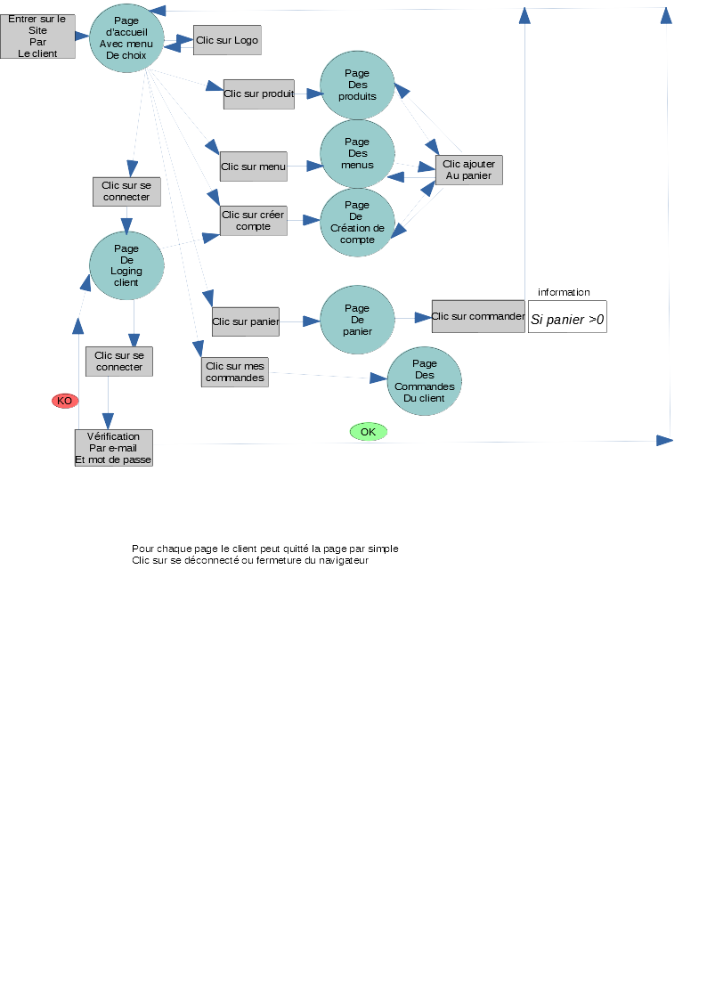

# creation d'un site pour un resto 
## techno utiliser JAVA EE avec le framwork spring boot
### developement coté back end
*** projet en cours ***
• Une chaîne de restauration rapide souhaite créer son site internet afin d’avoir une visibilité sur internet et pouvoir proposer un service de commande en ligne avec un mode livraison et emporter 
• Nom du restaurant: Fast food chic 
• Situé au 9 rue de la liberté à Lille 
• Téléphone 03 2O 10 20 30

<h1>la doc technique pour le site coté client</h1>
  

